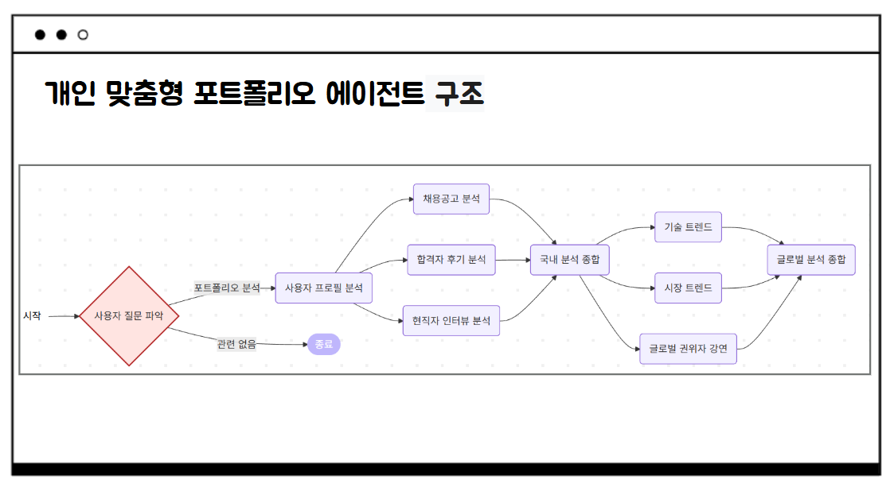
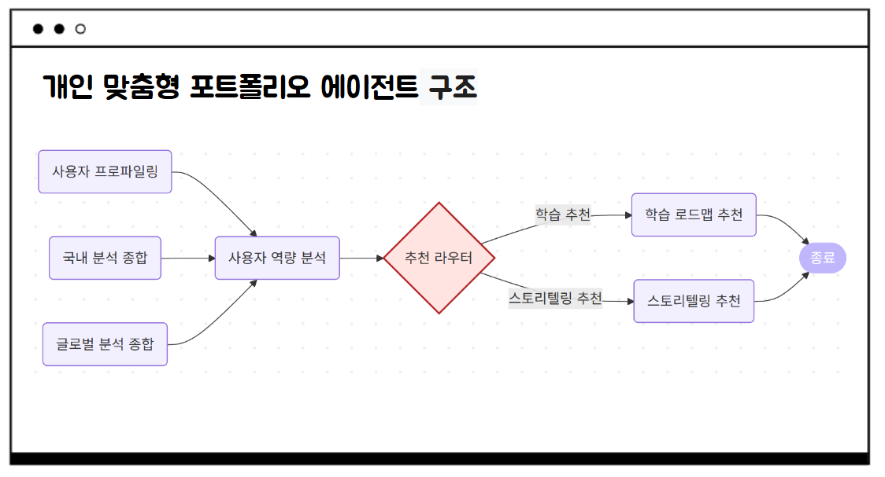

# Agent 기반 개인 맞춤형 취업 지원 플랫폼

(2025년 8월 완료한 프로젝트 아카이브입니다.)

LangGraph를 기반으로 사용자의 프로필을 분석하여 맞춤형 포트폴리오 개선안을 제시하는 AI 에이전트 프로젝트입니다.

---

## ⚙️ 환경 설정 (Setup)

### 1. 주요 라이브러리 (Dependencies)
본 프로젝트는 다음의 주요 라이브러리를 사용합니다. `main.py` 파일 실행 전, 이 라이브러리들이 설치되어 있어야 합니다.

* `langchain`
* `langgraph`
* `langchain-openai`
* `langchain-community`
* `pydantic`
* `google-api-python-client` (YouTube 검색용)
* `tavily-python` (Tavily 검색용)

### 2. 필수 API 키 (Required API Keys)
본 프로젝트는 다양한 외부 API를 활용합니다. `main.py`를 실행하기 전에, 다음 API 키들이 **시스템 환경 변수**로 설정되어 있어야 합니다.

* `OPENAI_API_KEY` (OpenAI)
* `TAVILY_API_KEY` (Tavily Search)
* `NAVER_CLIENT_ID` (Naver Search)
* `NAVER_CLIENT_SECRET` (Naver Search)
* `NEWS_API_KEY` (NewsAPI 등 글로벌 뉴스 검색용)

---

## 📁 프로젝트 구조 (Project Structure)

이 리포지토리는 다음과 같은 파일들로 구성되어 있습니다.

* `🚀 main.py`
    * (메인 실행 파일: LangGraph 워크플로우를 정의하고 컴파일 및 실행)
* `⚙️ report_generator.py`
    * (LangGraph의 모든 핵심 노드(Node) 함수들을 정의)
* `🧠 prompts.py`
    * (report_generator.py의 노드들이 사용하는 LLM 프롬프트 템플릿 모음)
* `🛠️ tools.py`
    * (report_generator.py의 노드들이 사용하는 도구(웹 검색, API 호출 등) 모음)
* `📄 requirements.txt`
    * (프로젝트 실행에 필요한 라이브러리 목록)
* `📜 README.md`
    * (현재 파일: 프로젝트 설명서)


## 📈 프로젝트 아키텍처 (Architecture)

본 프로젝트는 LangGraph를 기반으로 한 복잡한 비순환 그래프(DAG) 구조를 가집니다. 전체 흐름은 크게 **1) 분석 흐름 (Analysis Flow)**과 **2) 추천 흐름 (Recommendation Flow)**으로 나뉩니다.

### 1. 분석 흐름 (Analysis Flow)
사용자의 입력을 받아 시장과 트렌드를 분석하고 프로파일링하는 단계입니다.



1.  **사용자 질문 파악 (Intent Classifier)**: 사용자의 초기 입력을 받아 '포트폴리오 분석' 의도인지, '관련 없음'인지 분류합니다. 관련 없는 질문일 경우, 그래프는 즉시 종료(END)됩니다.
2.  **사용자 프로필 분석 (User Profiling)**: 사용자의 프로필(목표 직무, 경험 등)을 분석하고 요약합니다.
3.  **국내 분석 (Domestic Analysis - Parallel)**: '사용자 프로필'을 기반으로 3가지 분석을 **병렬**로 실행합니다.
    * `채용공고 분석 (analyze_postings)`
    * `합격자 후기 분석 (analyze_reviews)`
    * `현직자 인터뷰 분석 (analyze_interviews)`
4.  **국내 분석 종합 (Combine Domestic)**: 3개의 병렬 분석 결과를 하나로 취합합니다.
5.  **글로벌 트렌드 분석 (Global Trends - Parallel)**: '국내 분석' 결과를 기반으로 3가지 글로벌 트렌드 분석을 **병렬**로 실행합니다.
    * `기술 트렌드 분석 (analyze_tech_trends)`
    * `시장 트렌드 분석 (analyze_market_trends)`
    * `글로벌 권위자 강연 분석 (analyze_leaders_vision)`
6.  **글로벌 분석 종합 (Combine Global)**: 3개의 병렬 트렌드 분석 결과를 하나로 취합합니다.

### 2. 추천 흐름 (Recommendation Flow)
분석된 모든 정보를 바탕으로 사용자의 역량을 진단하고, 맞춤형 솔루션을 추천하는 단계입니다.



1.  **사용자 역량 분석 (Gap Analysis)**: 1~6단계에서 수집된 모든 정보(`사용자 프로파일링`, `국내 분석 종합`, `글로벌 분석 종합`)를 종합하여 사용자의 현재 역량과 목표 간의 '차이(Gap)'를 진단합니다.
2.  **추천 라우터 (Recommendation Router)**: 진단된 '차이'를 바탕으로, 사용자에게 '학습 로드맵'이 필요한지 '스토리텔링 가이드'가 필요한지 **조건부 분기**를 수행합니다.
3.  **최종 추천 (Final Recommendation)**: 라우터의 결정에 따라 두 분기 중 하나가 실행됩니다.
    * `학습 로드맵 추천 (recommend_learning)`
    * `스토리텔링 추천 (recommend_storytelling)`
4.  **종료 (END)**: 최종 추천안이 생성되면 그래프가 종료됩니다.

1.  (선택) 가상 환경을 생성하고 활성화합니다.
2.  필요한 라이브러리를 설치합니다. (`pip install -r requirements.txt` 또는 위 '주요 라이브러리' 참고)
3.  터미널(또는 시스템)에 위에서 언급된 5개의 `필수 API 키`를 환경 변수로 설정합니다.
4.  메인 스크립트를 실행합니다:
    ```bash
    python main.py
    ```
